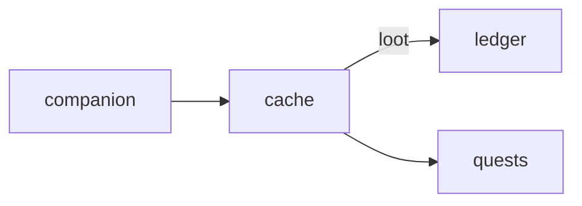

# Cache

**Pet Treasure Hunt** — Geocaching / AR hunt using pet instincts to find hidden world caches.

Part of [ComputerPets](https://github.com/RicheyWorks/computerpets). Map: [computerpets-ecosystem](https://github.com/RicheyWorks/computerpets-ecosystem).

| | |
| --- | --- |
| Status | Design scaffold — loop and engine frozen |
| License | MIT |
| Tokens | Minigames never mint or burn. Tired overlay, not a dead lineage. |
| First pet | [Meet Rui first](https://github.com/RicheyWorks/computerpets/blob/main/docs/START-HERE.md). This game is optional. |

## The loop

Desktop pets live on one machine. Cache takes a phone into Puyallup (or anywhere): Rui's nose widens the circle. No cache is inside a private home without owner opt-in.

## Who plays

Phone players outdoors. Indoor practice map if GPS is off.

## What it is not

Not a stalker app. No caches inside private homes without opt-in. Tracks die at 24h.

## Genre and engine

- Genre: **Location / AR**
- Engine: **React Native**
- Stack: React Native · Expo · geofence caches · optional AR markers · instincts = search radius
- Default surface: `Expo`

## Architecture



## How you play

1. Pick active pet on Companion.
2. Map shows fuzzy radius, not a pin.
3. On site, AR sniff minigame.
4. Cache loot is cosmetic / treats, never someone else's NFT.

## First slice

Build this and stop.

**Fuzzy radius + on-site sniff minigame awarding a treat, not an NFT.**

You know it works when: Spoofed speed rejected. Location denied: indoor map. Loot never someone else's token.

## Environment

Expo / Node 22

## Failure doctrine

Location permission denied → indoor practice map. GPS spoof → server rejects speed. Never store raw tracks longer than 24h.

Canon rules that never yield:

- 210 living kinds. No illegal hybrids.
- Overlay pets can get tired, sick, or hide. Tokens are not burned by a minigame.
- Desktop walk stays the main quest. Closing Cache must leave Rui walking.

## Neighbors

- computerpets-companion
- computerpets-ledger (finder's treats)
- computerpets-quests
- computerpets-telemetry (anonymous)

## Layout

```
computerpets-cache/
  README.md
  LICENSE
  docs/DESIGN.md
  src/                implementation lands here
```

## Run (Windows)

```powershell
cd app; npm install; npx expo start
```

Meet Rui first via the [flagship start-here](https://github.com/RicheyWorks/computerpets/blob/main/docs/START-HERE.md). This game is optional.

## Links

- Flagship: [RicheyWorks/computerpets](https://github.com/RicheyWorks/computerpets)
- This repo: [RicheyWorks/computerpets-cache](https://github.com/RicheyWorks/computerpets-cache)
- Map: [RicheyWorks/computerpets-ecosystem](https://github.com/RicheyWorks/computerpets-ecosystem)
- Design file: [docs/DESIGN.md](docs/DESIGN.md)

## License

MIT. See [LICENSE](LICENSE).

---

*Two hundred ten living kinds. Keep them so a line does not go quiet.*
