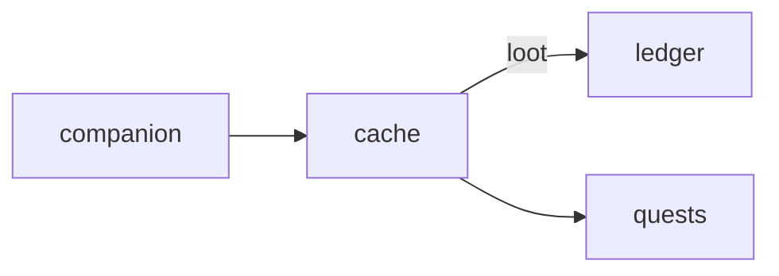

# Cache

**Take your pet's instincts on a treasure hunt.**

A planned location and AR game built around fuzzy search areas, species-aware clues, and optional indoor practice.

**Stage: design scaffold.** This checkout contains a design document and a source placeholder. The experience below is planned; there is no runnable app or integrated service yet.

[Status](#status) · [Planned experience](#planned-experience) · [Contributor quickstart](#contributor-quickstart) · [Game design](docs/DESIGN.md) · [Ecosystem map](https://github.com/RicheyWorks/computerpets-ecosystem)

## Status

| Available today | What you can inspect |
| --- | --- |
| [Game design](docs/DESIGN.md) | Intended behavior, boundaries, and planned dependencies. |
| [Source placeholder](src/index.ts) | Name metadata only; no package.json, app, or runtime is checked in. |
| [MIT license](LICENSE) | Licensing terms for the repository. |

Gameplay, endpoints, integration arrows, and failure handling on this page describe implementation targets. No build/test harness, CI workflow, or product screenshots are included in this scaffold.

## Planned experience

- Pick active pet on Companion.
- Map shows fuzzy radius, not a pin.
- On site, AR sniff minigame.
- Cache loot is cosmetic / treats, never someone else's NFT.

### Planned technology

- Genre: **Location / AR**
- Engine: **React Native**
- Stack: React Native · Expo · geofence caches · optional AR markers · instincts = search radius
- Default surface: `Expo`

### Planned connections

These arrows show intended dependencies, rather than working integrations.



## Contributor quickstart

With access to this private repository, Git and PowerShell are enough to review the scaffold:

```powershell
git clone https://github.com/RicheyWorks/computerpets-cache.git
Set-Location computerpets-cache
Get-Content docs/DESIGN.md
Get-Content src/index.ts
```

Read [Game design](docs/DESIGN.md) before choosing implementation details. The commands above inspect the checked-in files; app installation, editor launch, and server startup become possible after a buildable project and entry point are added.

### First implementation target

**Fuzzy radius + on-site sniff minigame awarding a treat, not an NFT.**

You know it works when: Spoofed speed rejected. Location denied: indoor map. Loot never someone else's token.

Treat this as an acceptance target for a future implementation. Start with the documented slice, add the required project setup and focused tests, and update these instructions with commands that work from a fresh clone.

## Design boundaries

1. Minigames cannot mint or burn NFTs by themselves (Minter is the write path).
2. Stats come from lived overlay care + Dojo caps, not cash shop.
3. Species kits stay inside Lore. Illegal hybrids never spawn.
4. Fail soft: the desktop overlay process is not this process.

**Required failure behavior:**

Location permission denied → indoor practice map. GPS spoof → server rejects speed. Never store raw tracks longer than 24h.

## Ecosystem

- [computerpets-companion](https://github.com/RicheyWorks/computerpets-companion)
- [computerpets-ledger](https://github.com/RicheyWorks/computerpets-ledger) (finder's treats)
- [computerpets-quests](https://github.com/RicheyWorks/computerpets-quests)
- [computerpets-telemetry](https://github.com/RicheyWorks/computerpets-telemetry) (anonymous)

Start with the [ComputerPets flagship](https://github.com/RicheyWorks/computerpets) for the desktop pet. This repository describes an optional extension; the [ecosystem map](https://github.com/RicheyWorks/computerpets-ecosystem) explains the broader plan.

## License

MIT. See [LICENSE](LICENSE).
